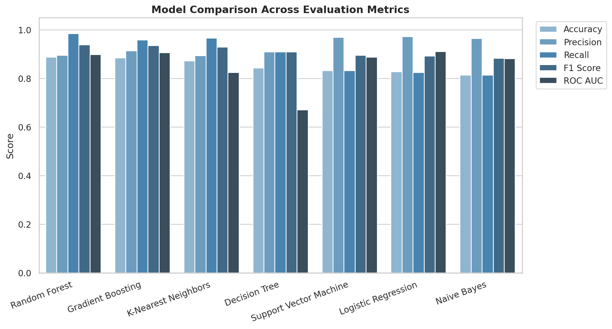
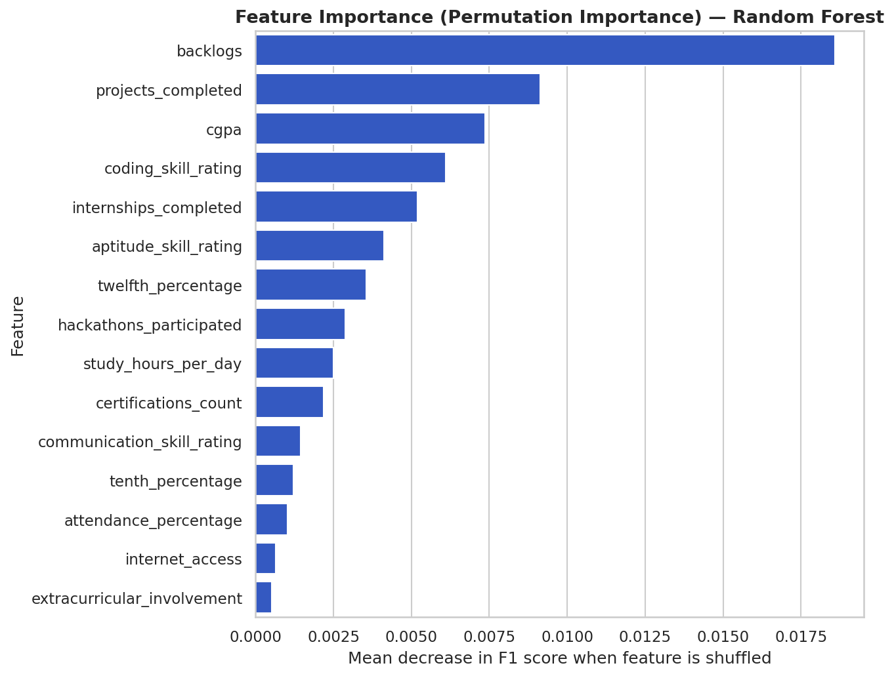
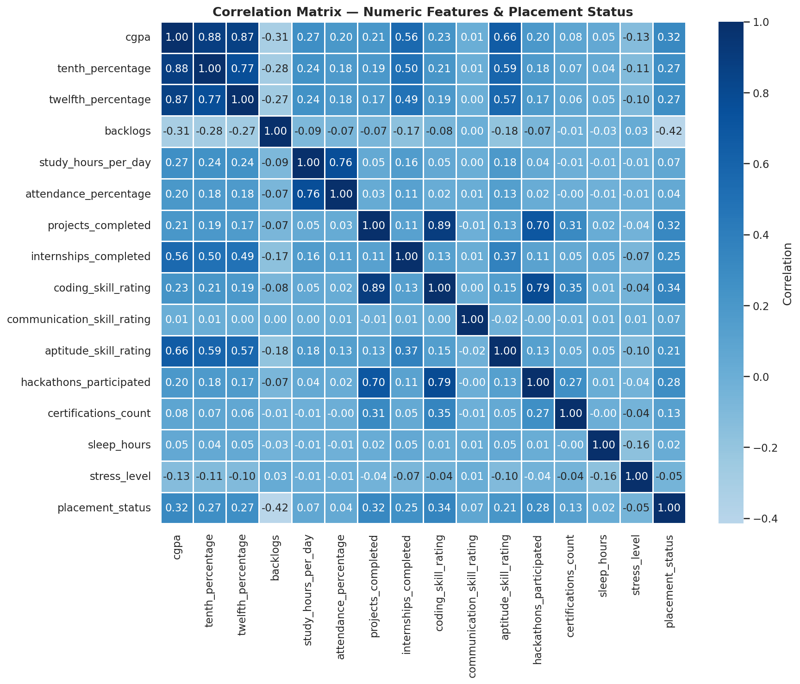
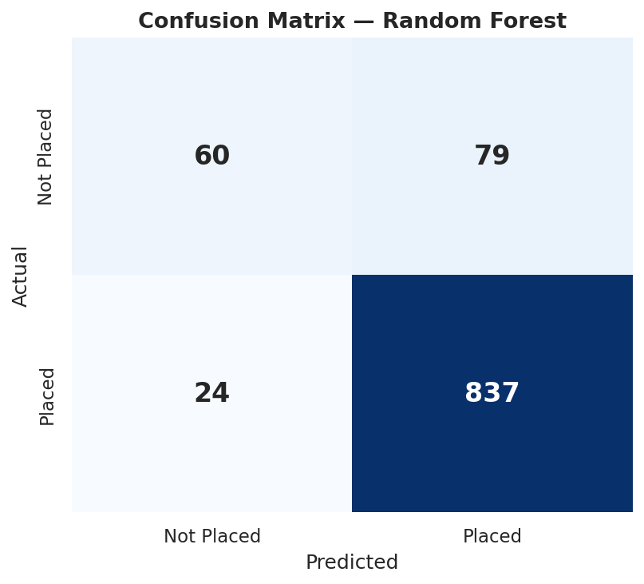

# 🎓 PlaceMint AI
### AI Resume Analyzer & Placement Prediction System

<p align="center">


</p>

<p align="center">
An AI-powered Resume Analyzer and Placement Prediction System that combines Machine Learning and Large Language Models (LLMs) to evaluate students' placement readiness, analyze resumes, and generate personalized career improvement recommendations.
</p>

---

# 🌐 Live Demo

### 🚀 https://placemint-ai-summertraining2026.streamlit.app/

---

# 📖 About The Project

PlaceMint AI is an intelligent placement assistance platform developed as a Machine Learning project at **Lovely Professional University**. The application combines traditional Machine Learning algorithms with modern Large Language Models to help engineering students evaluate their placement readiness through resume analysis and predictive analytics.

The platform predicts placement probability based on a student's academic performance, technical expertise, internships, projects, certifications, aptitude, communication skills, and various other career-related factors. In addition to prediction, the application provides AI-powered resume parsing and personalized career improvement recommendations that help students understand their strengths, identify improvement areas, and prepare more effectively for campus placements.

Unlike conventional placement prediction systems, PlaceMint AI focuses not only on generating accurate predictions but also on delivering meaningful insights that guide students towards better career outcomes. The project demonstrates practical applications of supervised machine learning, feature engineering, data visualization, model evaluation, resume parsing, and Generative AI in solving real-world educational and recruitment challenges.

---

# ✨ Features

- 🤖 AI Resume Analyzer
- 📄 Resume PDF Parsing
- 🎯 Placement Prediction
- 📊 Machine Learning Dashboard
- 📈 Feature Importance Visualization
- 📉 Correlation Heatmap
- 📚 Personalized Career Suggestions
- 🧠 AI Career Coaching
- 📋 Direct Manual Prediction
- ⚡ Fast Prediction Engine
- ☁️ Live Streamlit Deployment
- 📱 Responsive User Interface

---

# 🖥️ Application Modules

## 🏠 Home
- Project Overview
- Dataset Statistics
- Best Performing Model
- Performance Summary

## 📄 Resume Analyzer
- Upload Resume PDF
- AI Resume Parsing
- Feature Extraction
- Placement Prediction
- Personalized Recommendations

## 🎯 Direct Prediction
Students can manually enter academic and skill-related information including:

- CGPA
- 10th Percentage
- 12th Percentage
- Attendance
- Backlogs
- Study Hours
- Projects
- Internships
- Coding Skills
- Communication Skills
- Aptitude Skills
- Certifications
- Hackathons
- Stress Level
- Sleep Hours
- Extracurricular Activities

to instantly receive placement predictions.

## 📊 Model Performance

- Model Comparison
- Accuracy Analysis
- Confusion Matrix
- ROC Curve
- Precision
- Recall
- F1 Score
- Feature Importance
- Correlation Matrix

---

# 🧠 Machine Learning Workflow

```text
Dataset
      │
      ▼
Data Cleaning
      │
      ▼
Feature Engineering
      │
      ▼
Train-Test Split
      │
      ▼
Model Training
      │
      ▼
Model Evaluation
      │
      ▼
Best Model Selection
      │
      ▼
Deployment
```

---

# 📊 Dataset

The project is trained using a placement dataset containing approximately **5,000 student records** with multiple academic, technical, and career-related attributes.

### Features Included

- Student ID
- Gender
- Branch
- CGPA
- 10th Percentage
- 12th Percentage
- Attendance
- Backlogs
- Study Hours
- Projects
- Internships
- Coding Skill Rating
- Communication Skill Rating
- Aptitude Skill Rating
- Hackathons
- Certifications
- Sleep Hours
- Stress Level
- Part-Time Job
- Family Income
- City Tier
- Internet Access
- Extracurricular Activities
- Placement Status
- Salary (LPA)

---

# 📈 Model Performance

🏆 **Best Performing Model:** Random Forest Classifier

### Performance Metrics

- ✅ Accuracy: **89.7%**
- ✅ High F1 Score
- ✅ Precision & Recall Analysis
- ✅ ROC Curve
- ✅ Confusion Matrix
- ✅ Feature Importance

---

# 📸 Project Preview

## 🏠 Home Dashboard


---

## 📄 AI Resume Analyzer


---

## 🎯 Placement Prediction


---

## 📊 Model Performance Dashboard


---

# 📈 Machine Learning Visualizations

## Model Comparison



---

## Feature Importance



---

## Correlation Heatmap



---

## Confusion Matrix



---

# 🛠️ Tech Stack

### Frontend

- Streamlit

### Backend

- Python

### Machine Learning

- Scikit-learn
- Pandas
- NumPy

### Data Visualization

- Matplotlib
- Plotly

### AI Integration

- Groq API
- Llama 3.3 70B
- Llama 3.1 8B (Fallback)

### Resume Processing

- PyPDF2
- Regular Expressions
- AI-based Resume Parsing

---

# 📂 Project Structure

```text
PlaceMint-AI/
│
├── app.py
├── config/
├── pages/
├── utils/
├── data/
├── models/
├── notebooks/
├── reports/
├── assets/
├── templates/
├── requirements.txt
└── README.md
```

---

# 🚀 Installation

```bash
git clone https://github.com/Sudhanshuraj1037/PlaceMint-AI.git

cd PlaceMint-AI

python -m venv .venv

# Windows
.venv\Scripts\activate

# Linux / macOS
source .venv/bin/activate

pip install -r requirements.txt

streamlit run app.py
```

---

# 👨‍💻 Contributors

| Name | Roll No. | LinkedIn | GitHub |
|------|-----------|----------|---------|
| Hariom Tiwari | 12402165 | https://www.linkedin.com/in/hariom-tiwari-b2a325322/ | — |
| Preet Singh | 12407993 | https://www.linkedin.com/in/preet-bana10/ | https://github.com/Preet100 |
| Mridul Vatsal | 12405889 | https://www.linkedin.com/in/mridul-vatsal08 | https://github.com/Mridulvatsal |
| Sudhanshu Raj | 12406597 | https://www.linkedin.com/in/sudhanshu-raj-7b1651321 | https://github.com/Sudhanshuraj1037 |

---

# 🎓 Academic Information

**University:** Lovely Professional University, Phagwara, Punjab

**Department:** Department of Computer Science & Engineering

**Academic Session:** 2025 – 2026

**Project Guide:** Sir Anzar Hussain Lone

---

# 🔮 Future Enhancements

- ATS Resume Scoring
- Job Recommendation System
- Company-wise Placement Prediction
- Skill Gap Analysis
- Mock Interview Module
- Resume Builder
- Authentication System
- Student Dashboard
- Admin Portal
- Placement Analytics

---

# ⭐ Show Your Support

If you found this project useful, please consider giving it a **⭐ Star** on GitHub.

Your support motivates us to build more innovative AI-powered educational applications.

---

## 📜 License

This project is developed for academic and educational purposes at **Lovely Professional University**.

---

<p align="center">

Made with ❤️ by the PlaceMint AI Team

</p>
